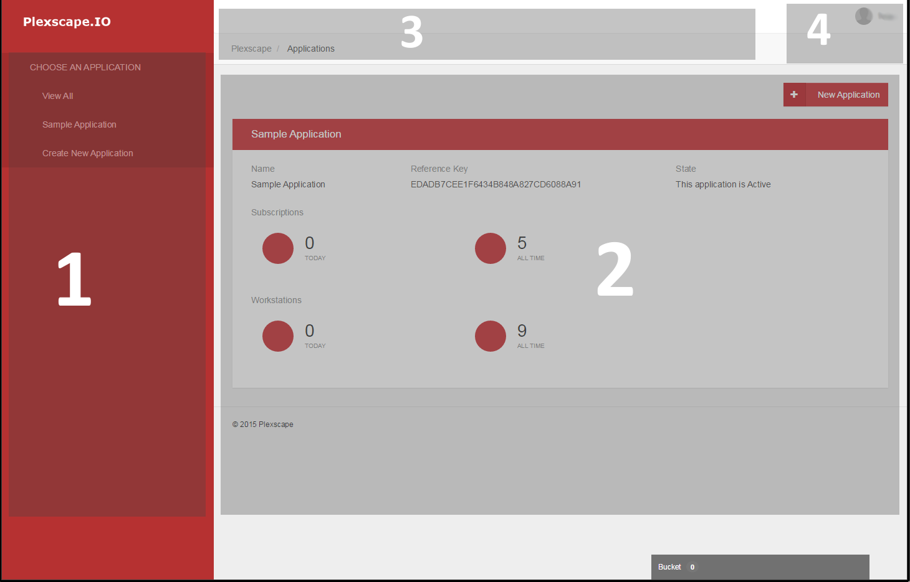
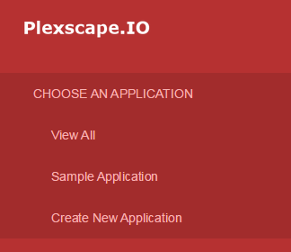
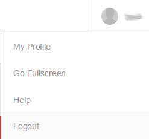
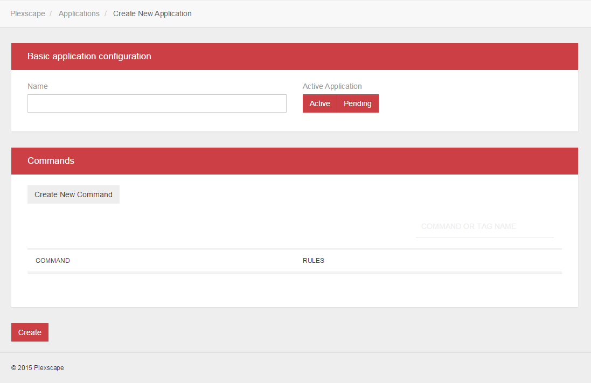
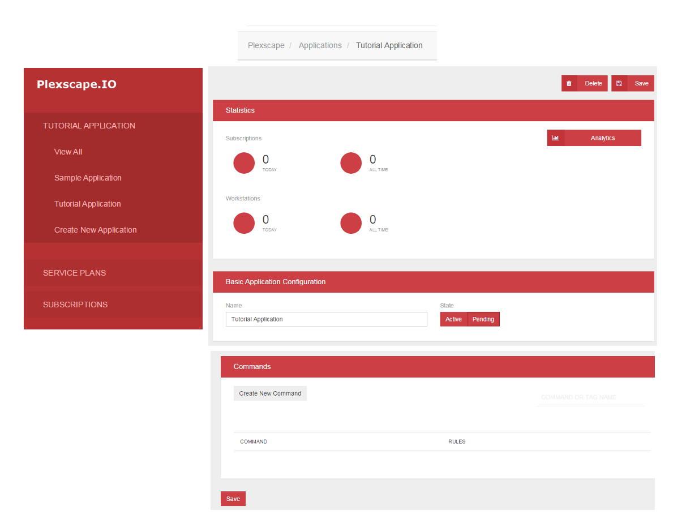
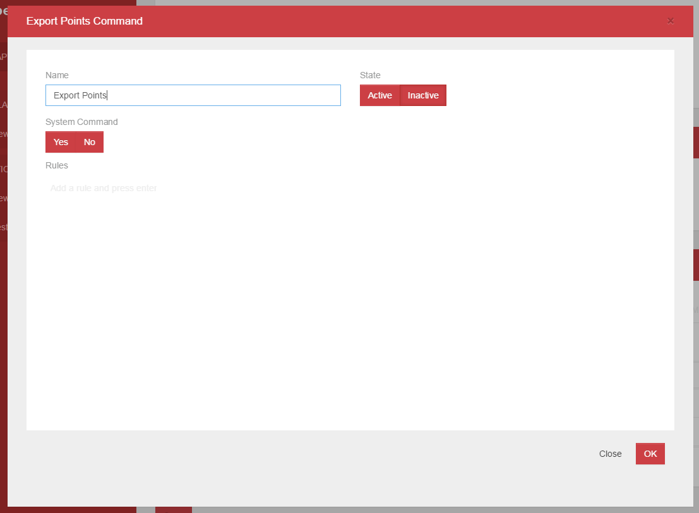

# Chapter 1 – The Application Application

  - [Meet the Web Console](chapter1.md#WebConsole)
  - [Create a new application](chapter1.md#CrateApplication)
  - [Add commands to the application](chapter1.md#CreateCommands)
  - [Service Plans](chapter1.md#ServicePlans)
  

  
## Meet the Web Console

It will be very helpful at this point to take a look at the web console for the platform to help put in 
perspective the relations between the account, 
the applications and the service plans, commands and subscriptions.

As seen in (Image 1.1) the interface consists four  parts. The first (1) is the side menu from which the user can navigate between applications, service plans and subscriptions. From here it is easy to understand the current scope of what is in focus at the moment, for example which application are we viewing. 

The second (2) is the main view where all information relevant to the current selection is shown. In (Image 1.1) the scope is at the top of the account. This means that no application is selected and thus in the menu we get a list of available applications and an option to create a new one (see Image 1.2) while in the main view we see all available application, formatted in blocks that present us with basic information (like the name and UIK) and statistics about each of them.

The third part (3) also has navigation as it's focus. It is a typical HTML style breadcrumb that shows where we are at present in the account tree and also shows all the path we have traversed while navigating here. Finally the fourth part (4) is the user menu, which presents some options about account management (Image 1.3).

  
  
## Create a new application

The first thing we need to define is the term application when used in the context of the platform. An application then is a reference to an actual software product that is created and lives inside a developer's account on the server, is identified by a unique identification key [UIK] and can contains multiple and different service plans, commands and rules. The UIK then is given to the developer to incorporate in his actual application and is used during communication with the server so that it is easy for it to identify which software product attempts to communicate with it and recover the relevant information that is requested.
The unique identification key is a string of numbers and alphabetical characters and it is generated by the system whenever a new application is created. Later, in part 2, you will see how the client uses this identifier to contact the server.

If you look at (Image 1.1) you see that at the moment there is only one existing application defined in our account. This is an application that has previously been created to run tests on the system. Lets assume for the purposes of this tutorial that this references one of my previous products that I wished to manage Licensing for. Now, let's go through the process of creating a new application for our hypothetical new product that you also want to manage. The first step is to select the “Create New Application” command from the side menu (see Image 1.2) or the “New Application” button at the top-right of part 2 of the interface as seen in (Image 1.1).

In the main view now we see two new blocks that present us with steps for creating a new application and at the bottom left a “Create” button. In the first (upper) block we see an input text box where you can enter a name for your application. This is the bare minimum of what you have to define in order to create an application. Next to it there is indication of whether the application is in an Active or Pending state. Active means that the application works normally. A software with the right reference (UIK) can communicate with the server and receive licensing info from this application. Pending means that the application is not accessible from the client yet and that some administrator actions are yet required until the state turns to Active. The Pending state is the default state when a new application is created. Once the proper action from the administrator is taken the user is notified either by e-mail or by the web console that the application is now Active.
Go ahead and fill the name form with anything you think is appropriate. For the purposes of this tutorial, you can name your application “Tutorial Application”. Then press “Create” at the bottom of the main view to complete creating the application. 

You can now see that on the side menu “Choose Application” has changed to “Tutorial Application”. This signifies that we are now examining the application you just created and also that it has actually been created. You can also see that there are two new labels under the usual side menu, [“Service Plans”](#ServicePlans) and [“Subscriptions”](chapter3.md). If you click on them you will open sub menus that allows you to create new service plans and subscriptions respectively and also list all the available ones for the current application. Since you haven't yet created any such it is empty, but we will revisit this soon. In the main view now you can see blocks with types of information about the application (Image 1.6).

If you can recall the main view from (Image 1.1) also contained a Statistics block. This block here is similar to that one with the only difference that in that image we are at the root of the navigation tree and we are presented with such blocks for all available applications while here we are presented with a Statistics block for the currently selected application plus two more blocks, one for the name and current state and one for managing commands. The Delete button can remove the application from the system entirely and both the top and bottom Save buttons are used to store any changes made, for example [adding commands](chapter1.md#CreateCommands) or renaming.

  
## Add commands to the application

If you select your application in the side menu the main view will change to present you with detailed information about it, categorized in blocks. Under the block named "Commands", there is an option to “Create New Command” and under it there are two columns names Commands and Rules. Commands are created in the scope of an application and rules are created in the scope of a command. But what is a command? In this context, a Command is a way to further control more specific actions of the client side by defining various behavioral rules for them. For example, let's say that among the many functions our software provides there is one or two which we do not want to be used unlimited times. We can create a command with rules that count the times the command is used by a client  and after a specified calls cut the use until subscription renewal. Another use could be to restrict the use of some functions to specific service plan subscribers only. Let's create to commands that will refer to the two commands (Export/Import) of our plugin as mentioned in the introduction. Click “Create New Command” and on the pop up form (Image 1.5) type “Export Points” in the name field and select “Active” under “State”.

Click “OK” at the bottom right and then repeat the process but this time type “Import Points” in the name field. You don't need to create rules for the commands at this points, just define them so they exist for the entire application's scope. You will later add rules to them in the scope of specific service plans.

Before leaving the application's screen you should click on Save, to make sure the changes we did by adding the commands are permanent.

  
## Service Plans

So we have an application! This is great but what are we going to do with it now? Well there are plenty of things to do! For starters, we would want to create a service plan, or a few of them depending on our licensing model. 

But what is the purpose of a service plan in this context you ask? As simple as it sounds, it is a way to define rules and behaviours that can be based upon to make licenses for user of your application later. Within the definition of a service plan you can also override the application's commands to modify limits and rules specificaly for this service plan.

As an example of what service plans can do, for our sample plugin we can define three service plans in order to demonstrate a wide range of the platform's capabilities.
The first service plan will be a Trial that requires registration, lasts for 15 days and allows both export/import commands to be used with no limit.
The second will be an anonymous Trial, that requires no registration, but last for only 5 days and allows only 20 calls to the Import command, while exporting is unlimited.
The third will be a 60 day subscription with unlimited uses of the Export and Import commands.

Creating Service plans will be explored in the next two chapters in detail... 

=========================
[Next](chapter2.md#Chapter2) -
[Home](README.md)