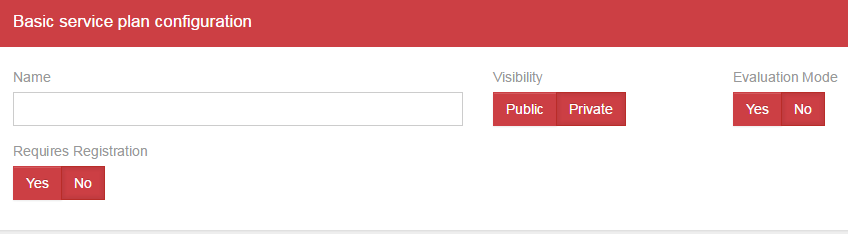
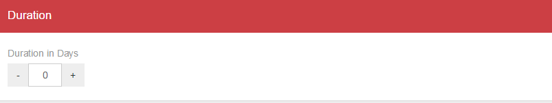
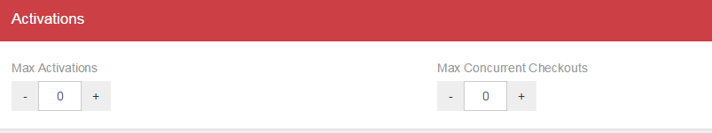
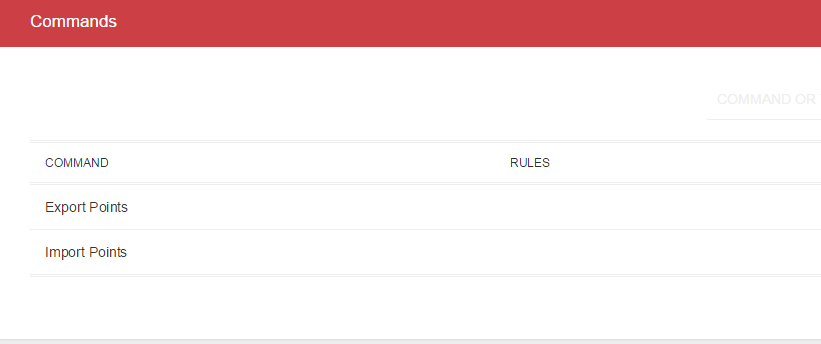
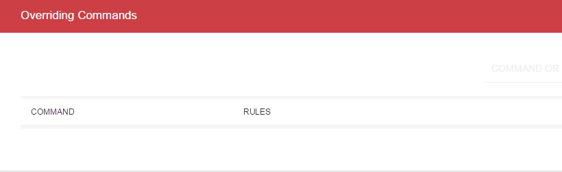
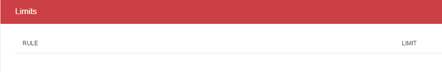
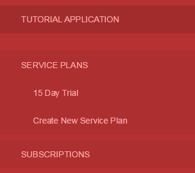
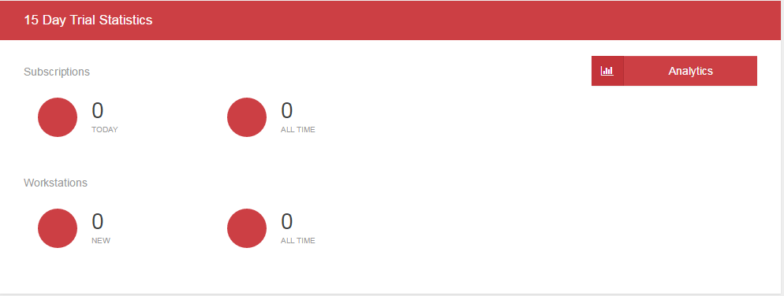
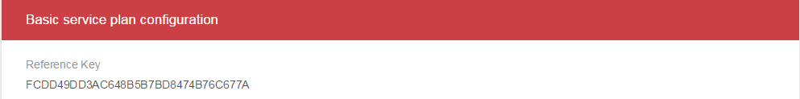

# Chapter 2 – Free Trials

  - [Creating a Registered Trial](chapter2.md#Registered)
  - [Creating an Anonymous Trial](chapter2.md#Anonymous)
  
Creating a plan that allows a period of using the product for free for testing purposes is a common practice. To create a Trial you need to create a service plan with proper values in some fields. Since Trials are free no subscription needs to be active in order for a user to atempt to activate her workstation, so a 'free subscription' with the properties of the trial service plan is automatically created when a workstation successfully begins a Trial period. 
  
  
  
## Creating a Registered Trial

Registration ties workstations under the service plan that require it to a user email. So to create a Trial that requires registration you need to follow the next steps to create an appropriate service plan:

Click on “Service Plans” on the side menu to open the sub menu if you haven't done so already. Now click on “Create New Service Plan”. The main view changes again to present us with new blocks that categorize aspects of a service plan. Something interesting to notice here is that in the “Commands” block you can see the two commands we created previously in the application's scope, and no option for the creation of a new command. That is because commands must always be defined in the scope of the entire application and can only be overriden within the scope of service plans.
Besides commands there are some other things we can determine about a service plan, and although they seem like a few options they provide us with great versatility.

In the Basic Configuration block we have a few options:
	* Define the name of the service plan.
	* Determine the visibility of the service plan. This determines whether the service plan will be included in a list of service plans returned from the server when the client asks for the available service plans. Public means it is returned, and private means it is not.
	* Evaluation mode indicates, when set to “yes”, that the service plan is a Trial service plan.
	* Finally as the name implies, “Requires Registration” indicates whether the system requires additional info from the end user to confirm his identity and finalize the subscription. Note that how this additional info is collected and what exactly is collected is left to the developer of the software, BUT an email is required in order for the user to receive a confirmation code.

In the Name field enter an appropriate name. We will name it “15 Day Trial”. Under visibility check “Public” and under Evaluation Mode check “Yes”. Finally, since this one will be a registered trial, check “Yes” under Requires Registration.
Next we need to define how many days each subscription created with this service plan has until expiration. Under the Duration block adjust the value of the Duration In Days field, setting it to 15. Note that a value of '0' means that subscriptions will never be active (they are created expired) and an empty value means that there is no expiration so subscriptions are active ad-infinitum.

The ”Activations” block provides some more options for control on the behavior of each subscription of this service plan. Specifically it allows us to limit the number of workstations that can be activated using one such subscription (“Max Activations”) and furthermore if we so wish we can also limit the number of activated workstations that can work at the same time (“Max Concurrent Checkouts”). For example a subscription may allow for 10 workstation activations but only 5 can work at the same time. Obviously the number of concurrent checkouts needs to be less than or equal to the number of Max Activations. For this service plan set both values to 1. 

Next we see three blocks that are about commands and their limits within the scope of the current service plan. We do not need to change anything here for now.

Click Create at the bottom of the main view to create you first service plan!

  
  
## Creating an Anonymous Trial

If you need to provide users with a quick way to test your product without them having to worry about providing personal information you will want to create an Anonymous Trial.

Click on “Service Plans” on the side menu to open the sub menu if you haven't done so already. Now click on “Create New Service Plan”. The main view changes again to present us with new blocks that categorize aspects of a service plan. Something interesting to notice here is that in the “Commands” block you can see the two commands we created previously in the application's scope, and no option for the creation of a new command. That is because commands must always be defined in the scope of the entire application and can only be overriden within the scope of service plans.
Besides commands there are some other things we can determine about a service plan, and although they seem like a few options they provide us with great versatility.

In the Basic Configuration block we have a few options:
	* Define the name of the service plan.
	* Determine the visibility of the service plan. This determines whether the service plan will be included in a list of service plans returned from the server when the client asks for the available service plans. Public means it is returned, and private means it is not.
	* Evaluation mode indicates, when set to “yes”, that the service plan is a Trial service plan.
	* Finally as the name implies, “Requires Registration” indicates whether the system requires additional info from the end user to confirm his identity and finalize the subscription. Note that how this additional info is collected and what exactly is collected is left to the developer of the software, BUT an email is required in order for the user to receive a confirmation code.

In the Name field enter an appropriate name. We will name it “5 Day Anonymous Trial”. Under visibility check “Public” and under Evaluation Mode check “Yes”. Finally,  check “No” under Requires Registration.
Next we need to define how many days each subscription created with this service plan has until expiration. Under the Duration block adjust the value of the Duration In Days field, setting it to 5.

Set both values in the Activations block to 1. 

Next we see three blocks that are about commands and their limits within the scope of the current service plan.

//TODO: add limits to import command.

Click Create at the bottom of the main view to create you first service plan!

=========================
[Next](chapter3.md#Chapter3) -
[Home](README.md)