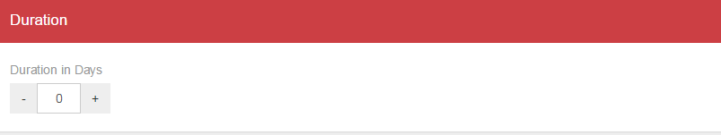
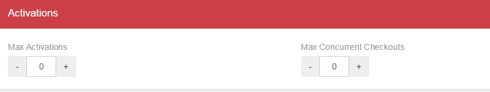

# Chapter 3 – Subscriptions

  - [3.1 – Creating a subscription Service Plan](chapter3.md#Step1)
  - [3.2 – Creating a subscription](chapter3.md#Step2)
  
We have seen how to create a service plan that supports Trial activations but not how to create subscription based plans. The procedure has two main steps. One is to create an appropriate service plan just like before only with some different properties. The other is to create the actual subscriptions. Why should we create these subscriptions here though? The idea is that Wings is a platform that helps manage License behaviour, activation, expiration, command limits etc. It is not a platform for managing payments. That can be any external platform, which, once the data is collected or the payment made, can signal the renewal of (or activation or any action required on) a subscription. With this in mind, subscriptions that require payment to be created cannot be created directly from the end user's client. Once the subscription has been approved and created though, the user will receive a registration key which he can use through the client to activate his workstation. Because this is a tutorial about using the licensing system we assume that the process of subscription creation at some external tool has been completed so we create a sample subscription [here](chapter3.md#Step3) to cover for that scenario.
  
  
  
## 3.1 – Creating a subscription Service Plan

Click on “Service Plans” on the side menu to open the sub menu select “Create New Service Plan”.

In the Basic Configuration block we have a few options:

* Set the name of the service plan to "60 Day Subscription".
* Set the visibility of the service plan to "private".
* Set Evaluation mode to “no”, indicating the service  is subscription based.
* Finally, “Requires Registration” should be set to "No" for this example. If we wanted to require registration for the subscription we could select it, but for simplicity and because we see how this works for the Registered Trial already it is better to leave as "no".

Next we need to define how many days each subscription created with this service plan has until expiration. Under the Duration block adjust the value of the Duration In Days field, setting it to 60. Note that a value of '0' means that subscriptions will never be active (they are created expired) and an empty value means that there is no expiration so subscriptions are active ad-infinitum.

The ”Activations” block provides some more options for control on the behavior of each subscription of this service plan. Specifically it allows us to limit the number of workstations that can be activated using one such subscription (“Max Activations”) and furthermore if we so wish we can also limit the number of activated workstations that can work at the same time (“Max Concurrent Checkouts”). For example a subscription may allow for 10 workstation activations but only 5 can work at the same time. Obviously the number of concurrent checkouts needs to be less than or equal to the number of Max Activations. In fact input these example numbers respectively to the appropriate fields now. 

In the commands section below we don't need to change anything, since we do not want to limit anything for this normal subscription.
Click Create at the bottom of the main view to create the service plan!
  
  
## 3.2 – Creating a subscription

Select “60 Day Subscription” from the side menu. At the top of the main view you will see four buttons as seen in (Image 1.11). Go Ahead and click the Create Subscription button. 

The main view will change yet again and a few blocks will appear. At this point most are not important except two: Select Active under State in Basic Configuration and select an activation period under  the "Activation Period" block. 

The  Activation Period is defined by two date values that designate the start of the activation and the expiration. What we can understand from this is that a subscription is active during a specific period of time, specified by the activation period. Whether a workstation is activated with this subscription or not during this period doesn't really affect the expiration.

Now scroll down to the bottom and hit “Create”. 
If you click the “View Subscriptions” button (Image 1.11) you will be presented with a list of the subscriptions currently under this service plan. If everything went as planned you will see the subscription you just created. You will also notice that the subscription is identified by a Key. This is the key the user must receive in order to activate his workstation via the client. Clicking on the key will take you to similar main view with the one we saw while creating the subscription. 

There are three differences:
* 1. There are two buttons on the top right. One for saving changes and one for deleting the subscription.
* 2. You can see the Key in the Basic subscription configuration block.
* 3. At the bottom there is another block that contains information on the workstations currently (if any) activated with this subscription.

And that's about it. We have pinned down the basic functionality of the web console and we can now create, edit and manage applications, service plans/subscriptions and resources/commands.
In the next part we will see how to implement a client that communicates with the platform.

=========================
[Next](chapter4.md#Chapter4) -
[Home](README.md)