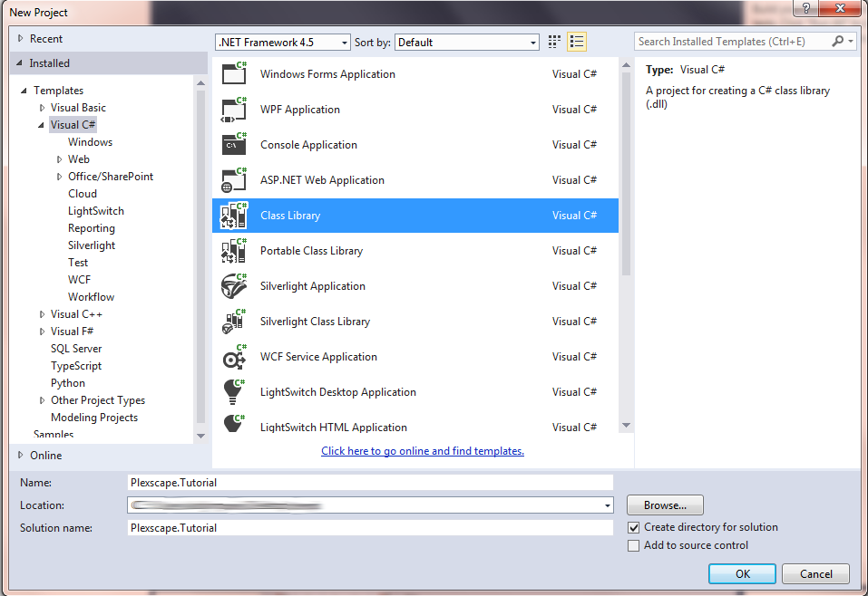
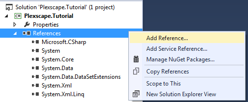
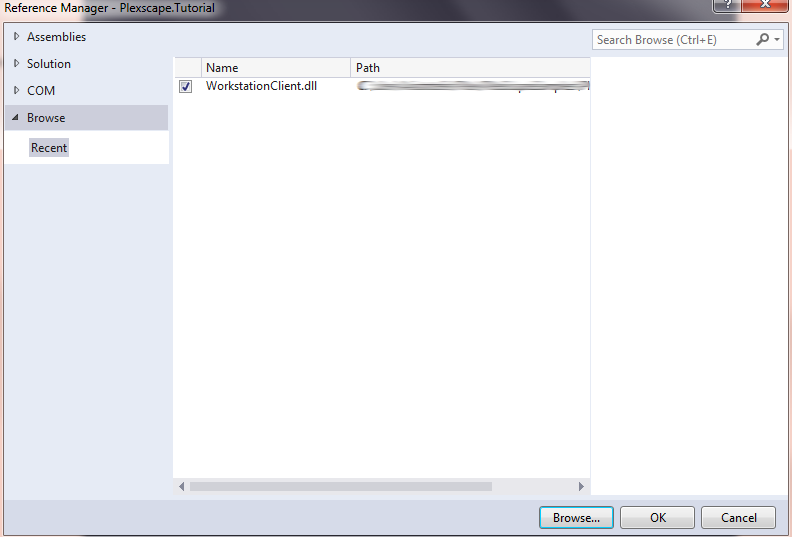
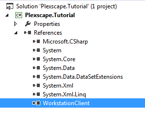

<a name="Chapter4"></a>
# Chapter 4 – The Client API

  - [4.1 – A Basic Client class layout](chapter4.md#Step1)
  - [4.2 – The SignIn Method](chapter4.md#Step2)
  - [4.3 – Starting a Registered Trial](chapter4.md#Step3)
  - [4.4 – Starting an Anonymous Trial](chapter4.md#Step4)
  - [4.5 – Activating a Subscription](chapter4.md#Step5)

In the previous chapter we explored the web-console and prepared the ground for what is to come by creating an application and within it some service plans. Now its time to get our handy dirty with a bit of code. This tutorial assumes you are familiar with the Visual Studio environment and the C# programming language. So let's begin!



The first step is to setup our environment. Open Visual Studio and create a new Visual C# Class Library Project with a suitable name. The interface might ask you to name the solution or it might name it automatically with the same name you gave to the project. Make sure you have “Create directory for solution” checked. Hit OK and the project is created with a sample Class1.cs file. You can delete that if you wish.



Now we need to add a reference to the “WorkstationClient.dll” to our project. Expand the project's References and select Add Reference..., then Browse to where the dll resides on your disk and select it, click Add, then make sure WorkstationClient.dll has a checked checkbox and click OK.




  <a name="Step1"></a>
## 4.1 – A Basic Client class layout

Now you need to create a C# class, name it something like “SampleClient” and follow the next steps:
* add the “public” keyword in front of the class' declaration
* add “using Plexscape.WebServices.Core;”
* add “using Plexscape.WebServices.WorkstationClient;”
* derive from IDisposable.
  
Then proceed to modify the implementation of the class likewise:

```
public class SampleClient : IDisposable
{
	/// <summary>
	/// Use a single client object per session.
	/// Created during construction by Factory.
	/// </summary>
	private IWorkstationClient Client;

	public void Dispose()
	{
		if (Client != null)
		{
			Client.UnloadClient();
		}
	}
}

```

=========================
[Next](chapter2.md#Chapter2) -
[Home](README.md)