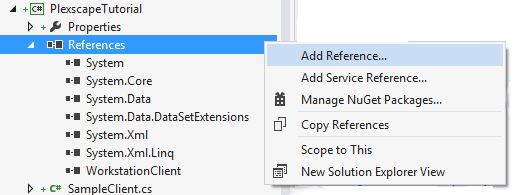
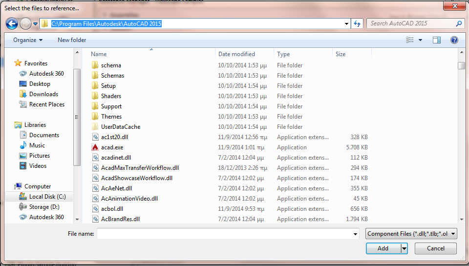
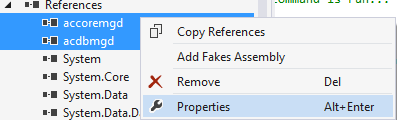
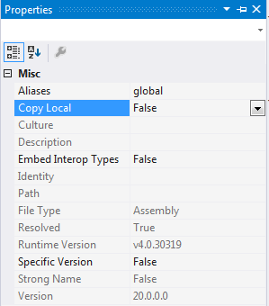

<a name="Chapter4"></a>
# Chapter 5 – The Plugin

  - [5.1 – Setting up the environment](chapter5.md#Step1)
  - [5.2 – Creating the AutoCad Command class](chapter5.md#Step2)
  - [5.3 – Adding Wings functionality to the Plugin](chapter5.md#Step3)

It's been a long trip until here, and although up to now we were concerned with Wings and how to use its Workstation API its is now time to actually use all we have created with a sample product. As we said earlier, for the purposes of this tutorial our product will be a simple autocad plugin and to crate this we need change our focus a bit and turn our attention to the autocad API. This is an easy task assuming you have knowledge of the API, but even if you don't or it has been some time since you've used it this chapter will help you refresh your skills (or learn the basics if its your first plugin).

This is also a good place to remind you that Wings is *not* in anyway bound to the autocad api. It could be used to license any product you develop, but the important structures of how you use it will resemble what you find here.
So without further ado let's begin!

  <a name="Step1"></a>
## 5.1 – Setting up the environment

To begin we must include the proper libraries in our project. These libraries are found in your autocad installation folder (we use autocad 2015 here but most versions follow the same rules). 

The default installation folder is usually Program Files > Autodesk > AutoCAD ####. There are many .dll files in there and many of them need to be included depending on the API functionality our plugin needs. Luckily we will only implement basic functionality so we need only a few of the libraries:
* accoremgd.dll
* acdbmgd.dll
* acmgd.dll



Select **Add Reference** under your projects References as in Image 3.2 and then select browse and navigate to the autocad installation folder, like in Image 3.1. Select the files mentioned above and then click Add.



The libraries now appear under references, meaning they are included. Select both of them, right click and hit Properties. In the properties change the value under *Copy Local* to **False**. Save your project.




  <a name="Step2"></a>
## 5.2 – Creating the AutoCad Command class

With this the setup is complete and our next step is to create a new class to host our plugin code.
* Create a new C# file under the project and name it SamplePlugin.cs
* Make the class public
* Add the following using statements at the top of the file:
  * `using Autodesk.AutoCAD.EditorInput;`
  * `using Autodesk.AutoCAD.Geometry;`
  * `using Autodesk.AutoCAD.Runtime;`
  * `using Autodesk.AutoCAD.Windows;`
* Add this attribute above the namespace declaration:
  * `[assembly:CommandClass(typeof(PlexscapeTutorial.SamplePlugin))]`
* Make the class an implementation of IExtensionApplication and implement the interface's methods.

After the changes your file should look something like this:

```c#
using Autodesk.AutoCAD.EditorInput;
using Autodesk.AutoCAD.Geometry;
using Autodesk.AutoCAD.Runtime;
using Autodesk.AutoCAD.Windows;

using System;
using System.Collections.Generic;
using System.Linq;
using System.Text;
using System.Threading.Tasks;

[assembly: CommandClass(typeof(PlexscapeTutorial.SamplePlugin))]
namespace PlexscapeTutorial
{
    public class SamplePlugin : IExtensionApplication
    {
        public void Initialize()
        {

        }

        public void Terminate()
        {

        }
    }
}

```

A few notes:
1. The Attribute you added identifies the class passed in its parameter as an acad api Command Class. This way, AutoCad can look for it, load it and load the commands it defines when the user requests it.
2. The interface you implemented provides methods that are called during initialization of the plugin which happens when the user calls *NETLOAD* to load the plugin in AutoCAD and during termination which happens when the AutoCad instance with the loaded plugin closes. You can implement any actions you need to have during these steps here.

Creating a command that can run in autocad is as simple as adding a method to the class and marking it with an attribute. In our case we want two commands, one for exporting points to a file and one for importing points from a file. Let's add them now.

```c#
[CommandMethod("SAMPLE_EXPORT_POINTS")]
public void SampleCommandEX()
{
	try
	{
		Document doc = Application.DocumentManager.MdiActiveDocument;
		Editor ed = doc.Editor;
		Database db = doc.Database;


		ExportPointsToFile(ed, db);
	}
	catch ()
	{

	}
}
```

```c#
[CommandMethod("SAMPLE_IMPORT_POINTS")]
public void SampleCommandIM()
{
	try
	{
		Document doc = Application.DocumentManager.MdiActiveDocument;
		Editor ed = doc.Editor;
		Database db = doc.Database;

		ImportPointsFromFile(db);
	}
	catch ()
	{

	}
}
```

* The attribute **CommandMethod** must mark any method that you want to be exposed as a command in AutoCAD.
* The attribute takes a string parameter that defines the name of the command, which is how the command is called inside AutoCad.
* All code in each command is surrounded by a try catch clause so that any internal errors in our code doesn't crash the entire AutoCad instance. Furthermore we can write handlers for various exceptions if we need.
* **ExportPointsToFile** and **ImportPointsFromFile** are private methods that contain the specific functionality respectivly for clarity.

Now we will implement the method that exports points to file. The user will be prompted to select points in the scene and then press enter, then prompted to select a file to export to.

```c#

private void ExportPointsToFile(Editor ed, Database db)
{
	//acad api collection specialized in managing Point3D objects
	Point3dCollection pts = new Point3dCollection();

	//First check if there was something already selected when 
	//the command was called.
	PromptSelectionResult acSSprompt = ed.SelectImplied();
	if (acSSprompt.Status == PromptStatus.OK)
	{
		// Clear the PickFirst selection set
		ObjectId[] idarrayEmpty = new ObjectId[0];
		ed.SetImpliedSelection(idarrayEmpty);

		// Request for objects to be selected in the drawing area
		acSSprompt = ed.GetSelection();
		if (acSSprompt.Status != PromptStatus.OK)
			return;
	}
	else
	{
		// Request for objects to be selected in the drawing area
		acSSprompt = ed.GetSelection();
		if (acSSprompt.Status != PromptStatus.OK)
			return;
	}

	//This is where the actual transaction with the database happens.
	//We iterate through the objectids returned from the user's input
	//and request the database to return each element.
	//We chack if it is indeed a point and if so add it to the collection.
	using (Transaction acTrans = db.TransactionManager.StartTransaction())
	{
		SelectionSet acSSet = acSSprompt.Value;

		foreach (SelectedObject acSSObj in acSSet)
		{
			if (acSSObj != null)
			{
				Entity acEnt = acTrans.GetObject(acSSObj.ObjectId, OpenMode.ForRead) as Entity;

				if (acEnt != null)
				{
					if (acEnt.GetType() == typeof(DBPoint))
						pts.Add(((DBPoint)acEnt).Position);
				}
			}
		}
	}

	//Invoke a windows SaveFile Dialog to prompt the user
	//to select a file to export to.
	string defaultPath = "C:/";
	defaultPath = Environment.GetFolderPath(Environment.SpecialFolder.MyDocuments);
	
	SaveFileDialog saveFile = new SaveFileDialog("Save Selected Points",
												 defaultPath,
												 "txt",
												 "SavingFile",
												 SaveFileDialog.SaveFileDialogFlags.DefaultIsFolder);

	System.Windows.Forms.DialogResult dr = saveFile.ShowDialog();
	if (dr == System.Windows.Forms.DialogResult.OK)
	{
		NumberFormatInfo numFormat = new NumberFormatInfo();
		numFormat.NumberDecimalSeparator = ".";
		numFormat.NumberGroupSeparator = ",";

		using (StreamWriter file = new StreamWriter(saveFile.Filename))
		{
			foreach (Point3d point in pts)
			{
				string line = "" + point.X.ToString(numFormat) + "," + point.Y.ToString(numFormat) + "," + point.Z.ToString(numFormat);
				file.WriteLine(line);
			}
		}
	}
}
```

* Transaction objects provide methods that allows communication with the Database like retrieving objects or inserting objects. All changes we need to do to the database go through a Transaction object, and are only finalized when transaction.Commit is called. If we add new objects to the scene for example and not call Commit the changes are scrapped.
* the Transaction object is contained inside a using statement because it needs to be disposed of when we are done with it, as any resource does.
* The SelectionSet gets the ObjectIds returned from GetSelection, stored inside the prompt result's Value property.

Similarly we will create a method that performs the import functionality but before we proceed let's create a very small private method that will help us read each line from an input file:

```c#

private void ImportPointsFromFile(Database db)
{
	string defaultPath = "C:/";
	defaultPath = Environment.GetFolderPath(Environment.SpecialFolder.MyDocuments);


	OpenFileDialog browseFile = new OpenFileDialog("Select File to Load Points From",
													defaultPath,
													"txt",
													"TextPointsFile",
													OpenFileDialog.OpenFileDialogFlags.DefaultIsFolder);


	System.Windows.Forms.DialogResult dr = browseFile.ShowDialog();
	if (dr != System.Windows.Forms.DialogResult.OK)
		return;

	NumberFormatInfo numFormat = new NumberFormatInfo();
	numFormat.NumberDecimalSeparator = ".";
	numFormat.NumberGroupSeparator = ",";

	//ReadLine is a private method that opens an existing file
	//and returns each line as a string.
	IEnumerable<Point3d> points = from line in this.ReadLines(browseFile.Filename)
								  let items = line.Split(',')
								  where items.Length == 3
								  select new Point3d(double.Parse(items[0], numFormat),
												  double.Parse(items[1], numFormat),
												  double.Parse(items[2], numFormat));

	using (Transaction acTrans = db.TransactionManager.StartTransaction())
	{
		BlockTable acBlkTbl;
		acBlkTbl = acTrans.GetObject(db.BlockTableId, OpenMode.ForRead) as BlockTable;

		BlockTableRecord acBlkTblRec;
		acBlkTblRec = acTrans.GetObject(acBlkTbl[BlockTableRecord.ModelSpace], OpenMode.ForWrite) as BlockTableRecord;

		foreach (Point3d point in points)
		{
			DBPoint acPoint = new DBPoint(point);

			acPoint.SetDatabaseDefaults();

			acBlkTblRec.AppendEntity(acPoint);
			acTrans.AddNewlyCreatedDBObject(acPoint, true);
		}

		acTrans.Commit();
	}
}
```
There are few more points of interest here:
* When we want to add objects directly to the scene we need to add them to the Model space block table record first and then inform the transaction
  * `acBlkTblRec.AppendEntity(acPoint);`
  * `acTrans.AddNewlyCreatedDBObject(acPoint, true);`
* A call to **Commit** must be made before the transaction expires if we want the changes to be applied to the document.

Save your project and build it.
At this point the plugin can actually run inside autocad, but licensing or Wings functionality has been added. This will be the focus of the next and final step.

  <a name="Step3"></a>
## 5.3 – Adding Wings functionality to the Plugin

The time has come for us to tie everything up together.
The first thing to do is add a [client](chapter4.md#Step1) object to our plugin. The plugin will use the client to communicate with the licensing server to determine weather the current workstation is activated or not. 
Furthermore we will add 
* a flag called _isActivated, initialized to false, that will remember whether the workstation has been activated or not during a session, so we avoid requesting the information from the server every time we run the command after activation
* a flag called _isInit to help so that all initialization will happen the first time we run any of the commands and only then

```c#

public class SamplePlugin : IExtensionApplication
{
        bool _isActivated = false;
		bool _isInit = false;
		//This class implements ISampleDisplay and 
		//can print the messages to the AutoCad interface.
        SampleDisplay _output;
        SampleClient _session;

        [CommandMethod("SAMPLE_EXPORT_POINTS")]
        public void SampleCommandEX()
        {
           //...
        }

        [CommandMethod("SAMPLE_IMPORT_POINTS")]
        public void SampleCommandIM()
        {
            //...
        }

        public void Initialize() { }
        public void Terminate() { }

        private void ExportPointsToFile(Editor ed, Database db)
        {
            //...
        }

        private void ImportPointsFromFile(Database db)
        {
            //...
        }

        private IEnumerable<string> ReadLines(string path)
        {
            //...
        }
}
```
The Init() method shown below should be added to SamplePlugin to manage all initialization. In it **SignIn** is called to request the server
for the status of the workstation. As described in [chapter 4](chapter4.md#Step2), it will return false if the workstation is not activated or doesn't
exist in the system yet. But if it returns true, it means that the workstation is reckognized and is activated, so we don't need to do anything else,
just mark the prodict as activated.

```c#
private void Init()
{
	/* ..initialize all objects needed for
	 * server communication and the winforms elements.*/
	_output = new SampleDisplay(Application.DocumentManager.MdiActiveDocument.Editor);
	_session = new SampleClient(_output);

	if (_session.SignIn())
		_isActivated = true;

	_isInit = true;
}
```
We do not want Init to run every time we call the commands. The first time one of them is called should initialize the whole system
and then it should stay initialized. That's why we use *_isInit*. Add the following lines at the top of both **SampleCommandEX** and **SampleCommandIM**,
right after `Database db = doc.Database;`.

```c#
if (!_isInit)
	Init();
```

Then we should add a check to see if the client is activated. If it is activated then the functionality called can proceed normally.
If it is not we should inform the user and ask him if he wants to activate now. The following code should be added in both commands
you've written above.

```c#
try
{
	Document doc = Application.DocumentManager.MdiActiveDocument;
	Editor ed = doc.Editor;
	Database db = doc.Database;

	if (!_isInit)
		Init();

	if (_isActivated)
	{
		//Call proper functionality method
	}
	else
	{
		SampleActivationStates status = _session.DetermineState();
		if (status == SampleActivationStates.ACTIVE)
		{
			_isActivated = true;
			string message = _session.GetServiceInfo();
			System.Windows.Forms.MessageBox.Show(message);
		}
		else
		{
			//Ask user if he wants to activate
			PromptKeywordOptions pko = new PromptKeywordOptions("Product not yet Activated. Do you want to activate now?");
			pko.Keywords.Add("YES");
			pko.Keywords.Add("NO");
			pko.AllowArbitraryInput = false;
			pko.AllowNone = false;

			PromptResult pkr = ed.GetKeywords(pko);
			if (pkr.Status == PromptStatus.OK)
			{
				if (pkr.StringResult.Equals("YES"))
					HandleActivationState(ed, status);//Decide what state the workstation is in
			}
		}
	}
}
catch (System.Exception e)
{
	_output.ShowResponseData("\nAn Error occured: " + e.Message);
}
```

Before implementing **HandleActivationState** let's add one more command, that can be used by the user to activate
the product on demand, not having to go through calling one of the other two commands intermediately.

```c#
[CommandMethod("SAMPLE_ACTIVATE_PRODUCT")]
public void ActivateProduct()
{
	try
	{
		Document doc = Application.DocumentManager.MdiActiveDocument;
		Editor ed = doc.Editor;
		Database db = doc.Database;

		if (!_isInit)
			Init();

		if (_isActivated)
		{
			_output.ShowResponseData("Workstation is already activated!");
		}
		else
		{
			SampleActivationStates status = _session.DetermineState();
			HandleActivationState(ed, status);
			
		}
	}
	catch (System.Exception e)
	{
		_output.ShowResponseData("\nAn Error occured: " + e.Message);
	}
}
```

Now we can proceed to implement **HandleActivationState** that actually gets a *state* as returned from the client's
*DetermineState* and decides what to show to the user and what data is needed to proceed with or complete the activation.

```c#
private void HandleActivationState(Editor ed, SampleActivationStates status)
{
	if (status == SampleActivationStates.NOT_ACTIVATED_YET)
	{
		//Query the user on what type of service plan she want to initiate.
		int selection = PromptForActivation(ed);
		switch (selection)
		{
			case 1:
				BeginAnonymousTrial(ed);
				break;
			case 2:
				BeginRegisteredTrial(ed);
				break;
			case 3:
				ActivateSubscription(ed);
				break;
			case 0:
			default:
				_output.ShowResponseData("Please activate your product or choose from the provided Trials!");
				break;
		}
	}
	else if (status == SampleActivationStates.PENDING_CONFIRMATION)
	{
		_output.ShowResponseData("Registered Trial Confirmation code required...");
		ConfirmRegisteredTrial(ed);
	}
}

//Query the user on what type of service plan she want to initiate.
private int PromptForActivation(Editor ed)
{
	PromptKeywordOptions pko = new PromptKeywordOptions("Please select to activate a Trial model or a subscription");
	pko.Keywords.Add("ANONYMOUSTRIAL");
	pko.Keywords.Add("REGISTEREDTRIAL");
	pko.Keywords.Add("SUBSCRIPTION");
	pko.AppendKeywordsToMessage = true;

	PromptResult pkr = ed.GetKeywords(pko);
	if (pkr.Status == PromptStatus.OK)
	{
		if (pkr.StringResult.Equals("ANONYMOUSTRIAL"))
			return 1;
		if (pkr.StringResult.Equals("REGISTEREDTRIAL"))
			return 2;
		if (pkr.StringResult.Equals("SUBSCRIPTION"))
			return 3;
	}

	return 0;
}
```

The structure of the plugin, activation checks and user interaction included, is in place. What remains to be seen are the implementations of the
methods responsible for using the Wings api through the client object in order to make the proper requests to the server and set the **_isActivated**
flaf according to the results.

```c#
private void BeginAnonymousTrial(Editor ed)
{
	_session.StartAnonymousTrial();
	SampleActivationStates state = _session.DetermineState(false, false);
	if (state == SampleActivationStates.ACTIVE)
	{
		_isActivated = true;
	}
}
```

```c#
private void BeginRegisteredTrial(Editor ed)
{
	bool loop = true;
	string email = string.Empty;

	PromptStringOptions pso = new PromptStringOptions("Please input a valid email address to register with:");
	pso.AllowSpaces = false;

	while (loop)
	{
		PromptResult psr = ed.GetString(pso);
		if (psr.Status == PromptStatus.OK)
		{
			if (psr.StringResult.IsEmailFormatted())
			{
				email = psr.StringResult;
				loop = false;
			}
			else
			{
				_output.ShowResponseData("Email not valid!");
			}
		}
		else if (psr.Status == PromptStatus.Cancel)
		{
			_output.ShowResponseData("Workstation needs to be activated to be used...");
			loop = false;
		} 
	}

	if (!email.Equals(string.Empty))
	{
		_session.StartRegisteredTrial(email, new Dictionary<string, string>());
		SampleActivationStates state = _session.DetermineState(false, false);
		if (state == SampleActivationStates.PENDING_CONFIRMATION)
		{
			ConfirmRegisteredTrial(ed);
		}
	}
}
```

```c#
private void ConfirmRegisteredTrial(Editor ed)
{
	bool loop = true;
	string code = string.Empty;

	PromptStringOptions pso = new PromptStringOptions("Please input the confirmation code that was sent to your registered email:");
	pso.AllowSpaces = false;

	while (loop)
	{
		PromptResult psr = ed.GetString(pso);
		if (psr.Status == PromptStatus.OK)
		{
			if (!psr.StringResult.IsNullEmptyOrWhiteSpace())
			{
				code = psr.StringResult;
				loop = false;
			}
			else
			{
				_output.ShowResponseData("Please enter confirmation code!");
			}
		}
		else if (psr.Status == PromptStatus.Cancel)
		{
			_output.ShowResponseData("Workstation needs to be activated to be used...");
			loop = false;
		}
	}

	if (!code.Equals(string.Empty))
	{
		_session.ConfirmRegisteredTrial(code);
		SampleActivationStates state = _session.DetermineState(false, false);
		if (state == SampleActivationStates.ACTIVE)
		{
			_isActivated = true;
		}
	}
}
```

```c#
private void ActivateSubscription(Editor ed)
{
	bool loop = true;
	string code = string.Empty;

	PromptStringOptions pso = new PromptStringOptions("Please input the subscription key you were provided with:");
	pso.AllowSpaces = false;

	while (loop)
	{
		PromptResult psr = ed.GetString(pso);
		if (psr.Status == PromptStatus.OK)
		{
			if (!psr.StringResult.IsNullEmptyOrWhiteSpace())
			{
				code = psr.StringResult;
				loop = false;
			}
			else
			{
				_output.ShowResponseData("Please enter subscription key!");
			}
		}
		else if (psr.Status == PromptStatus.Cancel)
		{
			_output.ShowResponseData("Workstation needs to be activated to be used...");
			loop = false;
		}
	}

	if (!code.Equals(string.Empty))
	{
		_session.StartSubscription(code);
		SampleActivationStates state = _session.DetermineState(false, false);
		if (state == SampleActivationStates.ACTIVE)
		{
			_isActivated = true;
		}
	}
}
```

This is it! Save and build your project, Load the dll in Autocad with NETLOAD and give it a try.
If you try to call any of the commands, say SAMPLE_EXPORT_POINTS, you will be informed that the workstation is not activated yet
and be prompted to decide if you want to activate it.
Then you can select what type of service plan you want to subscribe to and further steps will follow then accordignly.
For example if you select registered trial you will be prompted to enter a valid email. If you do, then an email will be sent
to that address with a confirmation code and the plugin will wait patiently for you to proovide it.
Should you choose to stop the process, by pressing esc for example, the next time you try to run a command or activate
the system will still expect you to give a confirmation code. This is your workstation state at the moment.

Within the WorkstationClient api, there are methods that can help you reset this process and go back a step to provide a different email address
if something went wrong, but it isn't in the scope of this beginner tutorial to go too deeply in these things.

Congratulations, you have created your first Wings licensed and managed plugin! Test it out, play with the code, try the api and our support team is present for every questions you may have!
=========================
[Next](chapter5.md#Chapter5) -
[Home](README.md)