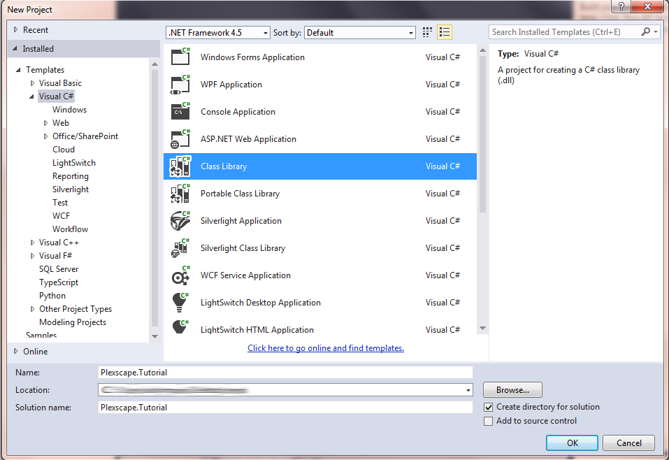
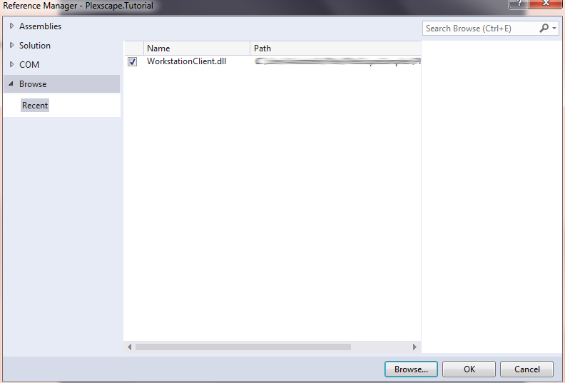

<a name="Chapter4"></a>
# Chapter 4 – The Client API

  - [4.1 – A Basic Client class layout](chapter4.md#Step1)
  - [4.2 – The SignIn Method](chapter4.md#Step2)
  - [4.3 – Starting a Registered Trial](chapter4.md#Step3)
  - [4.4 – Starting an Anonymous Trial](chapter4.md#Step4)
  - [4.5 – Activating a Subscription](chapter4.md#Step5)

In the previous chapter we explored the web-console and prepared the ground for what is to come by creating an application and within it some service plans. Now its time to get our handy dirty with a bit of code. This tutorial assumes you are familiar with the Visual Studio environment and the C# programming language. So let's begin!



The first step is to setup our environment. Open Visual Studio and create a new Visual C# Class Library Project with a suitable name. The interface might ask you to name the solution or it might name it automatically with the same name you gave to the project. Make sure you have “Create directory for solution” checked. Hit OK and the project is created with a sample Class1.cs file. You can delete that if you wish.


Now we need to add a reference to the “WorkstationClient.dll” to our project. Expand the project's References and select Add Reference..., then Browse to where the dll resides on your disk and select it, click Add, then make sure WorkstationClient.dll has a checked checkbox and click OK.




  <a name="Step1"></a>
## 4.1 – A Basic Client class layout

Now you need to create a C# class, name it something like “SampleClient” and follow the next steps:
* add the “public” keyword in front of the class' declaration
* add “using Plexscape.WebServices.Core;”
* add “using Plexscape.WebServices.WorkstationClient;”
* derive from IDisposable.
  
Then proceed to modify the implementation of the class likewise:

```c#
public class SampleClient : IDisposable
{
	/// <summary>
	/// Use a single client object per session.
	/// Created during construction by Factory.
	/// </summary>
	private IWorkstationClient Client;
	
	/// <summary>
	/// Registers an object that can be used to 
	/// display messages to the user.
	/// ISampleDisplay should posses methods to
	/// display both errors and messages or responses
	/// in detail and it should be implemented based on
	/// the specifics of your product.
	/// </summary>
	private ISampleDisplay Display;

	public void Dispose()
	{
		if (Client != null)
		{
			Client.UnloadClient();
		}
	}
}

```
Two things happen here. First we add a private field called Client of type IWorkstationClient. IWorkstationClient is an interface describing all the public methods available to the client. In essence, our “SampleClient” class acts as a wrapper to the IWorkstationClient in order to expose methods that are closer to our needs. Next we implement the Dispose method from IDisposable. IWorkstationClient objects need to implement an UnloadClient method which should be called during disposal of any object that contains such a client reference.

Up to this point we haven't seen how we would obtain an object that implements IWorkstationClient though. The good part is, we don't need to implement this interface. In fact we don't need to know much about the inner workings of such an object and how it communicates with the server, and we don't need to know anything at all about the server. We only need to receive an object and be able to use its implementations of the IWorkstationClient methods. And the library provides us this object through a Factory. Let's take a look at the constructor of our class:

```c#
public SampleClient(ISampleDisplay display)
{
	Display = display;
	// Get an instance of the workstation client
	Client = WorkstationClientFactory.CreateClient();

	// Populate a dictionary with (client-side) environment values
	Dictionary<string, string> environmentData = new Dictionary<string, string>() {
		{ PlexDtoKeys.Product, SampleConstants.Product_Name },         // Required
		{ PlexDtoKeys.Version, SampleConstants.Product_Version },             // Required
		{ PlexDtoKeys.StationName, SampleConstants.Product_StationName },     // Optional
		{ PlexDtoKeys.ApplicationReference, SampleConstants.TUTORIAL_APP_KEY }  // Required
	};

	// Note that the caller can optionally provide an IWebProxy object 
	// to have control over HTTP access and proxy settings
	if (!Client.LoadClient(environmentData/*, IWebProxy webProxy*/))
	{
		Display.ShowErrors(Client.GetErrors(), "LOAD");
	}
}
```

WorkstationClientFactory is a class provided by the WorkstationClient API that allows the creation of objects conforming to the IWorkstationClient interface without the developer having to implement it himself. Thus the heavy-lifting of the client-server communication is taken from the developer's hands and placed on the API itself. But not everything is done magically by the workstation client, however nice that would've been. The developer needs to have an understanding on what data needs to be sent to the server, depending on what the client requests, and in what form these data should be.

This is where the next declaration comes into play:

```c#
Dictionary<string, string> environmentData = new Dictionary<string, string>() {
		{ PlexDtoKeys.Product, "SamplePlugin" },         // Required
		{ PlexDtoKeys.Version, "1.0.0.0" },             // Required
		{ PlexDtoKeys.StationName, "sample-test-station" },     // Optional
		{ PlexDtoKeys.ApplicationReference, "E2F7911DB8184749A74BD2BD97E3369C" }  // Required
	};
```
Here we see three things:
* First, the data will be organized in a Dictionary format, where both the key and the value needs to be a string.
* Second, the Keys of the dictionary are predefined constant values, defined in the PlexDtoKeys class. For the dictionary to be considered valid, the keys must be taken from these values.
* Third, the dictionary can have as many records as the developer needs, but some entries are REQUIRED as denoted by the comments next to them in the above code.

There is something else we see here, invoking memories from part 1 of our tutorial! In the required entry that specifies the application which we want to reference, the value is the reference key that was generated for us when we created our Tutorial Application in the web console in part 1. It is assumed that the developer knows this identifier at the time he starts developing his client. (Typically, he will either take the key himself from the web console like we did, or it will be communicated to him from Plexscape).

The next step is to try and Load the client. The client's LoadClient method takes the environment data we specified in the previous step as a parameter and returns a bool value indicating whether the action was successful or not. It is apparent then why we call this directly in the “if” statement:
we check directly if the call returned a false value in which case we proceed to manage the errors.
The next few lines of code use the client's GetErrors method and prints each of them to the console.
Note that errors are returned in the form of a class named PlexError, which provides us with an Error Code and a Message to gives more information about what occurred.

```c#
// The caller can optionally provide an IWebProxy object 
// to have control over HTTP access and proxy settings
if (!Client.LoadClient(environmentData/*, IWebProxy webProxy*/))
{
	Display.ShowErrors(Client.GetErrors(), "LOAD");
}
```

  <a name="Step2"></a>
## 4.2 – The SignIn Method

Now everything is in place for us to start implementing the actual client functionality. The first thing to do take a look at the methods exposed by the *IWorkstationClient* interface. 
Out of those, the two we need to discuss first in order to get our client going are **InitWorkstation** and **GetServiceStatus**.
The first is a very important call and it is actually the first call we need to make when beginning our session. In essence it asks the server to check if the workstation is activated with a license and everything is OK to proceed. Besides the start of the session there are a few more points at which we have to make this call, like after attempting a subscription activation with a positive response, in order to complete the activation process. The return value is boolean to define success or failure. If the call fails it means there are errors, which we can retrieve with **Client.GetErrors()** and we can show them to the user if we want.

Let's create the method that will be called to begin the session when the client starts. In case that there are errors we display them and return false. The call to InitWorkstation is the bread and butter here. If it is successful it means that the server is ready and the workstation has been activated. If not, then either there is some internal server error or the client was not found under the specific subscription meaning it needs activation.

```c#
public bool StartClient()
{
	// Initialize the workstation
	if (!Client.InitWorkstation())
	{
		Display.ShowErrors(Client.GetErrors(), "INIT");
		return false;
	}
	return true;
}
```

**GetServiceStatus** on the other hand can be called whenever we need to check with the status of the server. Progress of requests, errors, failures in requests or successful calls are all described by an arithmetic number returned by this method. It also has an out parameter that returns more specific info in the well known by now dictionary format. The status is returned as an *int* code and it is a best practice to keep their handling within the scope of the client class and hidden from the UI and the final user.


Then go back to the SampleClient class and create the method that will handle server status codes. We'll call it CheckoutWorkstation, and it's purpose will be to ask the servers for its current status and to distinguish between status codes, take proper action if we want and return the appropriate value from the enumerator. This will actually be the most central call of the client. It should be called after a request to the server that has a chance to fail and it should be called whenever we want to check if the workstation checks out. What does that mean? It means that the workstation has asked the server “Do I have an active license in your records?” and the server responded “yes”.
In any other case, we will see some soon, or if the server has faced some internal problem then the workstation doesn't or cannot checkout and the method handles the status and returns accordingly.

```c#
/// <summary>
/// Checks the current service status, handles
/// errors internally and returns a client state.
/// </summary>
/// <returns>
/// SampleActivationStates is an enumerator that describes
/// which states the client might enter.
/// Not provided by the Api, it was created for the scope
/// of the tutorial.
/// </returns>
public SampleActivationStates SignIn(
            bool showErrors = true,
            bool showResponse = true)
{
	// Get current status to provide info to caller
	Dictionary<string, string> statusData;
	if (!Client.GetServiceStatus(out statusData))
	{
		if (showErrors)
			Display.ShowErrors(Client.GetErrors(), "STATUS");
	}
	else
	{
		if (showResponse) // Display status data
			Display.ShowResponseData("  Status values received:", statusData);
	}

	PlexError error = Client.GetLastError();
	int status = (error != null) ? error.Code : PlexResponseCode.OK;

	if (status == PlexResponseCode.PendingConfirmation)
		return SampleActivationStates.PENDING_CONFIRMATION;
	else if (status == PlexResponseCode.PendingRegistration)
		return SampleActivationStates.NOT_ACTIVATED_YET;
	else if (status >= PlexResponseCode.SERVER_ERROR_BASE)
		return SampleActivationStates.NOT_ACTIVATED_YET;
	else
		return SampleActivationStates.ACTIVE;
}
```
With these methods we can create the client, start it and see if the workstation is activated or not. 
Now we should take care of what can be done if it is not.

  <a name="Step3"></a>
## 4.3 – Starting a Registered Trial

The registered Trial uses the service plan we created [here](chapter2.md#Registered).
Remember that registration based service plans require an email on which activated workstations will be bound on.
Furthermore, the system uses this email to provide the user with a confirmation email that contains
a code, required to complete the activation.

So activating a workstation with a registered service plan is a two step process.:

* The first step includes calling **BeginRegisteredTrial** method from IWorkstationClient, which begins the process by creating a subscription under the trial service plan and registering the workstation to it. Then it sends a confrmation email to the address that was provided with a code that was just generated.

```c#
public void StartRegisteredTrial(string email, Dictionary<string, string> userData)
{
	// Start a registered trial
	if (!Client.BeginRegisteredTrial(SampleConstants.SUB_TRIAL_15D_REG, email, userData))
	{
		Display.ShowErrors(Client.GetErrors(), "BEGIN_REGISTER");
	}
}
```

At this point the workstation is identified by the system but it is not activated and the registration is not complete. The service reckognizes the workstation as being
in a state of limbo awaiting the completion of the registration process.

* The second step completes the process by validating the confirmation key provided by the user by calling **ConfirmRegistration** and then calling *InitWorkstation* thus activating the workstation.

```c#
public bool ConfirmRegisteredTrial(string confirmationCode)
{
	// Confirm the registration
	if (!Client.ConfirmRegistration(confirmationCode))
	{
		Display.ShowErrors(Client.GetErrors(), "CONFIRM_REGISTER");
		return false;
	}

	// Call InitWorkstation() again to complete the INIT phase
	if (!Client.InitWorkstation())
	{
		Display.ShowErrors(Client.GetErrors(), "INIT");
		return false;
	}

	return true;
}
```
> Note that after returning from these nethods, a call to **SignIn()** is desirable, especially when there is need to manage client states.
> For example a result of *false* in *ConfirmRegisteredTrial* means there was an error in the process and it needs to be handled and the client to enter some specific state
> for say, accepting commands from the user.

Add the above methods to your SampleClient class and save your project.

  <a name="Step4"></a>
## 4.4 – Starting an Anonymous Trial

Starting an Anonymous Trial is a simpler process than the registered trial case. 
That's because no registration is needed, so there is only one call to the server to determine which service plan the workstation is requesting activation with.
The Api method to call first is **BeginAnonymousTrial** with the anonymous trial service plan reference key as a parameter.
If this returns successfully then the subscription is created and the workstation identified in the system, and *InitWorkstation* should be called to attempt activation.
If this is also successful the workstation is active with an anonymous trial.

```c#
public bool StartAnonymousTrial()
{
	// Start anonymous trial
	if (!Client.BeginAnonymousTrial(SampleConstants.SUB_TRIAL_5D_NOREG))
	{
		Display.ShowErrors(Client.GetErrors(), "BEGIN_ANONYMOUS");
		return false;
	}

	// Call InitWorkstation() again to complete the INIT phase
	if (!Client.InitWorkstation())
	{
		Display.ShowErrors(Client.GetErrors(), "INIT");
		return false;
	}

	return true;
}
```

  <a name="Step5"></a>
## 4.5 – Activating a Subscription

Activating a Subscription is simple. Since for a payment service plan a subscription has already been created by other means as we described [here](chapter3.md) and the user has received the subscription activation key,
all that is needed is a call to  **BeginService** with the activation key as a parameter.
If this returns successfully then the workstation has been identified by the system, and *InitWorkstation* should be called to attempt activation.
If this is also successful the workstation is then active.

```c#
public bool StartSubscription(string subscriptionReference)
{
	if (!Client.BeginService(subscriptionReference))
	{
		Display.ShowErrors(Client.GetErrors(), "BEGIN_SERVICE");
		return false;
	}

	// Call InitWorkstation() again to complete the INIT phase
	if (!Client.InitWorkstation())
	{
		Display.ShowErrors(Client.GetErrors(), "INIT");
		return false;
	}

	return true;
}
```

=========================
[Next](chapter5.md#Chapter5) -
[Home](README.md)